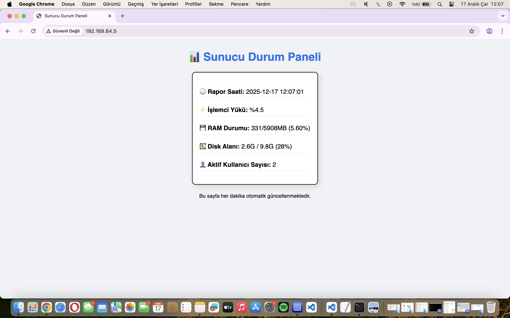

# 👤 ÖĞRENCİ BİLGİLERİ
* **Ad Soyad:** Hidayet Opuz
* **Öğrenci Numarası:** B231200015
* **Ders:** Bilişim Sistemleri Altyapı ve Teknolojileri

---

# Linux Sunucu İzleme Sistemi ve Otomasyon Projesi

Bu proje, Linux sistem araçlarını kullanarak sunucu kaynaklarını anlık olarak izlemek ve bu verileri bir web arayüzüne (Dashboard) dönüştürmek amacıyla geliştirilmiştir.

## 🛠 Teknik Mimari ve Kullanılan Araçlar

### 1. Kurulan Paketler
Sistemin çalışması için aşağıdaki paketlerin kurulumu yapılmıştır:
- **Nginx:** HTML raporunu web üzerinden yayınlamak için kuruldu.
- **Procps & Coreutils:** Sistem verilerini (top, free, df) çekmek için kullanıldı.

### 2. Veri Çekme (`monitor.sh`)
- **Tarih ve Saat:** `date` komutu ile rapor zamanı eklendi.
- **CPU:** `top -bn1` komutu ile işlemci yükü hesaplandı.
- **RAM:** `free -m` komutu ve `awk` ile veriler işlendi.
- **Disk:** `df -h` ile doluluk oranları çekildi.
- **Kullanıcı:** `who` komutu ile aktif oturum sayısı alındı.

### 3. Otomasyon (Cronjob)
Scriptin manuel müdahale olmadan her dakika çalışması için `crontab -e` ile şu satır eklenmiştir:
`* * * * * /bin/bash /home/hdyt16/monitor.sh`

## 📊 Sistem Görüntüsü (Dashboard)
Aşağıdaki görsel, projenin tarayıcı üzerindeki çalışma kanıtıdır:

